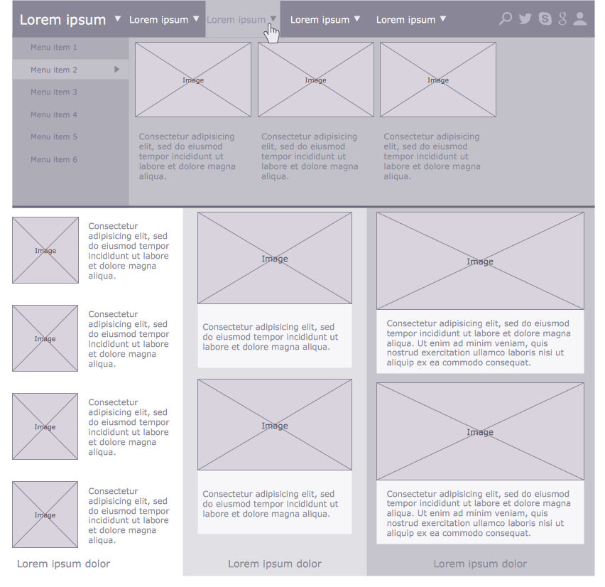
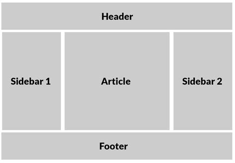
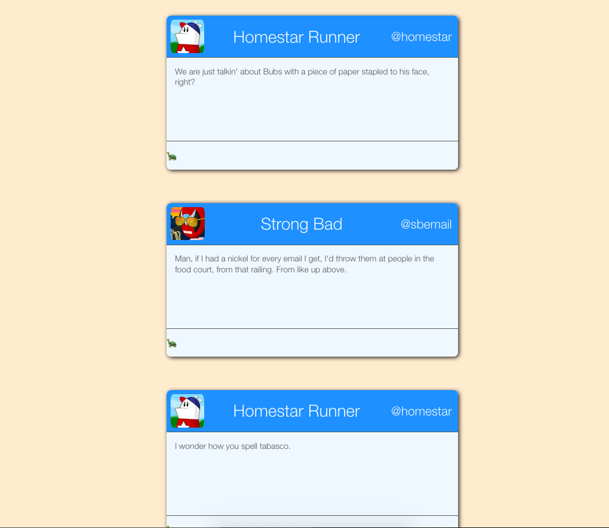
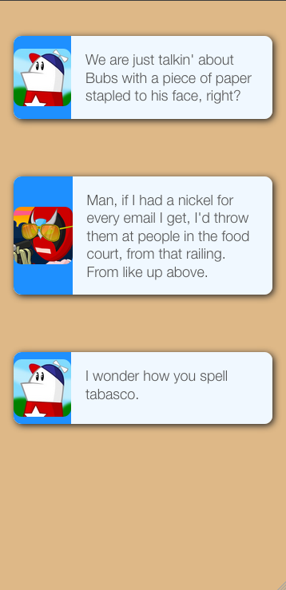

# Lead In Stuff

* Mobile traffic accounts for more than half of all internet traffic
  - On some sites, it may be substantially more than half

# What is Responsive Design?


**Okay Definitions**

* Usually just means "different layout for different viewport width"
  - Or, more concretely: "Does it look good on mobile and also on desktop?"
* Can also refer to things like "What does this look like when you print it?"

**Better Definition**

> _Responsive design is a page's ability to respond to variable content and variable contexts._

The question "How responsive is your page?" is answered by responding to questions like:

* "How does the page look at different viewport sizes?"
* "How does the page look with far more or far less text?"
* "How does the page look on different browsers and platforms?"
* "How does the page look with images of various sizes?"

# Approaches to Responsive Design

* Just use Bootstrap (🤮)
* Adaptive Web Design (Make 3 sites) (Not actually "responsive")
  - Mobile Wikipedia, for example: https://en.m.wikipedia.org/wiki/Main_Page
* One design; Media queries to configure layout
* Fluid layout

--------

* Mobile first vs. Mobile separate vs. Mobile never

# Examples of Responsive Design (and also not-very-responsive design)
[Some eCommerce Site](http://juicedboards.com/) - Very bread-and-butter responsiveness
[BBC.com](bbc.com) - More advanced information architecture at different viewport sizes
[Peaceful Restaurant](http://peacefulrestaurant.com/) - Uh oh.
[Guilt & Company](http://www.guiltandcompany.com/) - Beautiful site, _not_ mobile responsive

# Plan A: Layouts that are inherently responsive

> _"When you code CSS, you're writing abstract rules to take unknown content and organize it in an unknown medium. That shit is hard."_ - Keith J. Grant

Often, a developer will receive a wireframe design like the following:



The intent is that the designer will have done some thinking about things such as proportions, margins, sizes, and perhaps font faces and colors. The developer has just to implement what the designer dreamed up. It'll be 45 minutes, tops.

But it isn't so simple. That may be true for the design of a page in a newspaper or magazine, but this is the web: The text will not be uniform-- How will the page adjust if the text content is much longer or much shorter than in the wireframe? The number of menu items may be variable. The window can end up being much wider or much narrower than intended.

## Flexbox

`<opinion>`Flexbox is not the _only_ correct way to do layout, but it's the _most_ correct way to do layout.`</opinion>`

### Key Terminology

**Flex container:** The parent element, which has `display: flex` applied to it.

**Flex item:** An item inside of a flex container

**Main axis:** The direction that the flexbox arranges its items. This can be either a row, or a column.

**Cross axis:** The axis that is not the main axis, and is in fact orthogonal to it. If the flex container is arranging things lefty-righty, the cross axis is uppy-downy (and vice-versa, of course).

**Justify:** How things are arranged on the main axis.

**Align:** How things are arranged on the cross axis.

### Getting Started

Flexbox is very powerful and expressive, but to get started with it, you only need to know four properties:

| Property  | Values | Default Value | What It's For |
| --------- | ------ | ------------------ |
| `display` | `flex` | `block`/`inline`, usually | Tells a container that it's a flexbox, and all of its children are flex items |
| `flex-direction` | `row`, `column` | `row` | Determines whether the flex items line up horizontally (`row`) or vertically (`column`) |
| `justify-content` | `flex-start`, `flex-end`, `center`, `space-around`, `space-between`, `space-evenly`, `stretch` | `flex-start` | How items are arranged along the **main axis** |
| `align-items` | `baseline`, `flex-start`, `flex-end`, `center`, `space-around`, `space-between`, `space-evenly`, `stretch` | `stretch` | How items are arranged along the **main axis** |

 **Note:** Value lists are not exhaustive, but contain the ones that we are most interested in.

### Super Simple Sample

The following HTML will generate a simple flexbox: Four paragraphs, arranged in a row.

**CSS**
```
section {
  display: flex;
}
```

**HTML**
```
<section>
  <p>One</p>
  <p>Two</p>
  <p>Three</p>
  <p>Four</p>
</section>
```


### The Holy Grail

This layout was considered almost unattainable (or at least, unattainable without great sacrifice) for many years. With Flexbox though, it's easy. Here is what the layout looks like:



To get this layout, we start with markup like the following:

```
<body>
  <header></header>
  <main>
    <aside></aside>
    <article></article>
    <aside></aside>
  </main>
  <footer></footer>
</body>
```

Then, the core CSS is quite straightforward:

```
body {
  display: flex;
  flex-direction: column;
}

main {
  display: flex;
}
```

There's a little bit more to it than that, but essentially, we are ready to start making decisions about things like what **content** the layout will have (and how it will behave), what the `min-width` and `max-width` of the different elements will be, and when the page will switch to a **different layout strategy**.

### Making Responsive Cards with Flexbox

* `section` represents the card
  - Flex column
* `header`, `main`, and `footer` mean what it sounds like they mean
  - Flex row
* Header items are `space-between`'d to get the first and last pushed all the way to the corners

```
<section>
  <header>
    
    <h1 class="name">Homestar Runner</h1>
    <h2 class="handle">@homestar</h2>
  </header>
  <main>
    <p>...</p>
  </main>
  <footer>
    <p></p>
  </footer>
</section>
```



**Tolerances**

When programming a dynamic layout, it's prudent to test how tolerant it is to extreme **context** and **content**. In this case, it starts breaking down around `35em` (partly because we hard-coded cards to be 35em wide).

When a layout's tolerances are exceeded (like when the viewport becomes very small), we change to a different plan with **media queries**, which we will talk about later. Using Flexbox, we can use the same markup to restyle entire components:



For the mobile version:

* Much of the styling is inherited
* The background is `burlywood` now, just for contrast
* Each section is `row` instead of `column`
* The content **stretches** more than before
* Some elements are **hidden**

So how does this desktop vs. mobile plan work?

# Plan B: Media Queries

* Plan B should usually be used in conjunction with (not instead of) Plan A.
* A media query has a **media type** and a number of **media feature** expressions.
* They can be combined with logical operators

## Media Types

There are only four media types:

* `all` - Every device
* `screen` - Devices with screens; Laptops, phones, tablets, smart TVs, etc.
* `print` - Devices made of paper, such as pieces of paper. Also, print previews. This allows you to set special styling for someone wanting to print your page.
* `speech` - Intended for speech synthesizers.

There used to be more (`tty`, `tv`, `projection`, `handheld`, `braille`, `embossed`, and `aural`) but they have been deprecated. Not many people were developing websites in braille.

## Media Features

While media types are quite straightforward, there are many media features. Features are specific attributes about the context that the webpage is viewed in. The full list is available here:

https://developer.mozilla.org/en-US/docs/Web/CSS/Media_Queries/Using_media_queries#Media_features

For responsive design, however, the most common thing that we care about is viewport width. That is, whether the viewport is bigger/smaller than a certain size.


### min-width and max-width

Usually, we will use a **range prefix** on the width attribute to say "All pixel ranges that are greater/less than n," where n is the number of pixels (or ems, or some other unit).

| Attribute | Behavior | Example |
| --------- | -------- | ------- |
| `max-width` | Fire if the screen width is less than or equal to n | `@media (max-width: 720px)` |
| `min-width` | Fire if the screen width is greater than or equal to n | `@media (min-width: 480px)` |

## Example

```
img {
  max-width: 1080px;
}

@media (max-width: 480px) {
  img {
    max-width: 90%;
  }
}
```

## Choosing Breakpoints

* How do you decide what pixel values to set your breakpoints to?
* Old plan: Device widths
  - This is bad
* Modern plan: Find the natural breakpoints in your layout

## Gotcha! -- Meta Tags

To make media queries work as expected, we need to define the size of the viewport with a `meta` tag in our page's head.

```
<meta name="viewport" content="width=device-width">
```

This meta tag says to the browser "This page's width adapts to the width of your device." This is necessary for reasons that are dumb and bad.

Details:

http://www.javierusobiaga.com/blog/stop-using-the-viewport-tag-until-you-know-ho/
https://webdesign.tutsplus.com/articles/quick-tip-dont-forget-the-viewport-meta-tag--webdesign-5972

# SASS

https://sass-lang.com/


# Useful Stuff

* overflow: hidden;
* 100vw;
* display: flex;
  - flex-direction: column;
  - justify-content: space-around | space-between | flex-start | flex-end;
* div[class*='small-']

# References

The article that coined the term (and described in detail the concept of) "Responsive Design:" https://alistapart.com/article/responsive-web-design

Everything you need to know about Flexbox: https://css-tricks.com/snippets/css/a-guide-to-flexbox/

# Blerp

Making a responsive table
  - Emoji column headers?
  - Ellipsis overflow...?
  - Card view......? <- Adaptive design
